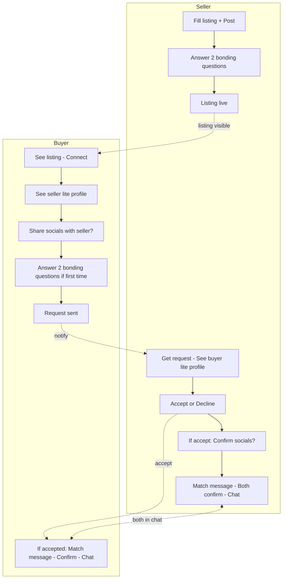
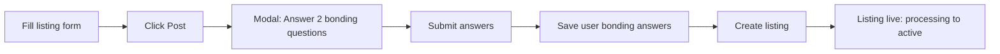
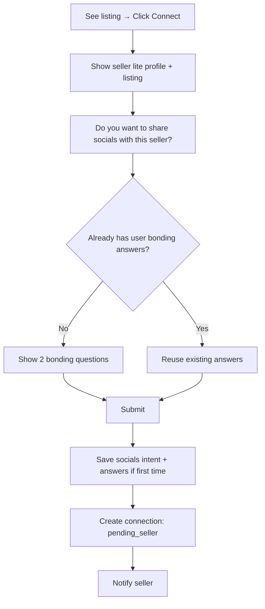
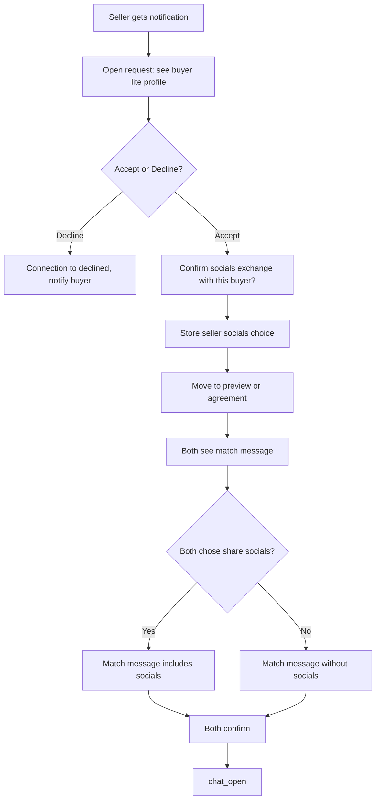
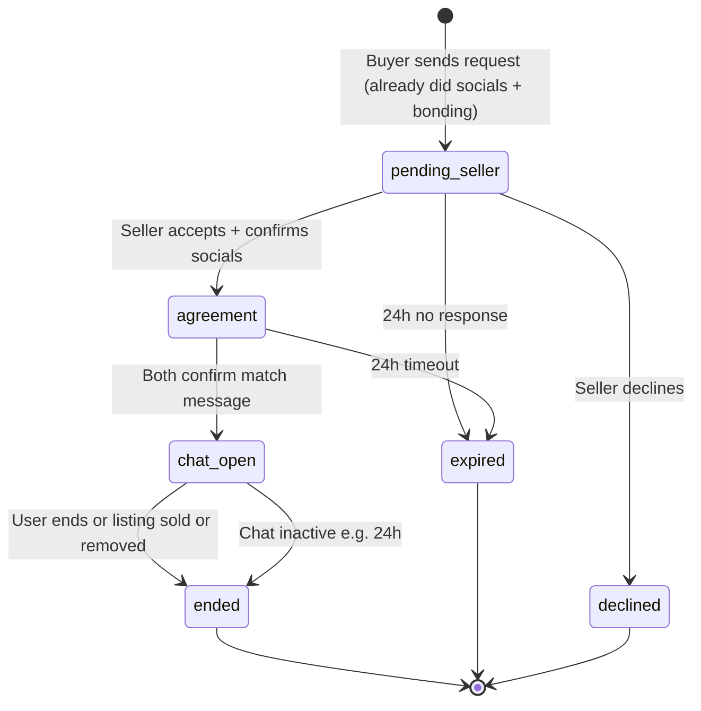
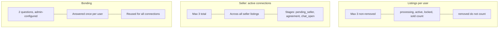
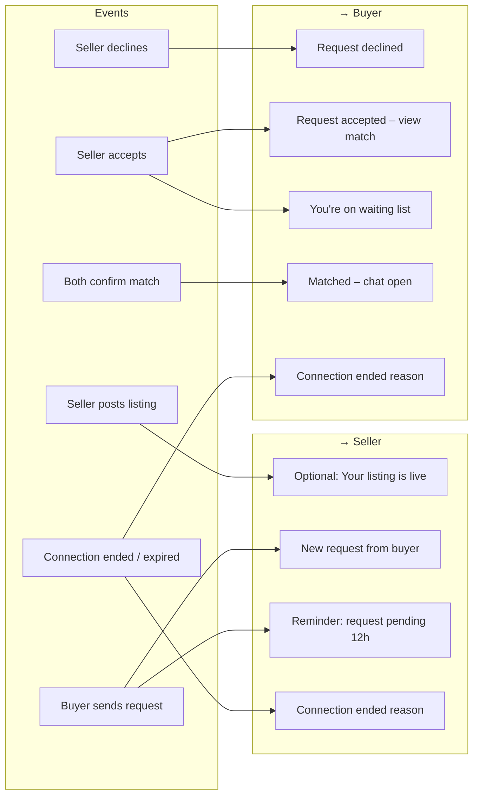

# Connections flow v2 – Proposal (new listings + migration)

This document describes **proposed** changes to the connection lifecycle. It does not reflect current behavior until implemented. The current flow is in [connections-flow.md](./connections-flow.md).

---

## 1. Design goals

- **Trust up front:** Sellers answer 2 bonding questions when posting; buyers answer 2 bonding questions when connecting (and confirm socials intent). Same 2 questions for everyone; answers are **per user** and reused across all connections.
- **Simpler limits:** Max 3 listings per user (non-removed); max 3 active connections per seller (total, not per listing).
- **Socials decided early:** Buyer decides “share socials with this seller?” before the request is sent; seller decides “share socials with this buyer?” when accepting. If both yes → matching message includes socials.

### Overview (v2 flows)

---

## 2. New flow for new listings

### 2.1 Seller: post listing

1. Seller fills listing (city, date, seats, etc.) and clicks **Post**.
2. **New step (before listing goes live):** A window appears: *“Please answer these two questions to build trust with ARMY buyers.”*  
   - Same 2 global bonding questions (admin-configured).  
   - Seller submits answers.  
3. Answers are stored **per user** (e.g. `user_bonding_answers` or equivalent), not per connection.
4. Listing is then created and goes live as today (e.g. processing → active).

**Data / backend (conceptual):**

- New or reused store for “user’s bonding answers” (user_id, question_ids, answers, updated_at).
- Listing creation API or a new “post-listing bonding” step that saves these answers and then creates the listing.

---

### 2.2 Buyer: connect to listing

1. Buyer sees listing and clicks **Connect**.
2. **Single step (before any request is sent):**
   - Buyer sees **seller’s lite profile** (and listing summary).
   - Buyer chooses: **“Do you want to share socials with this seller?”** (Yes / No).
   - If the buyer has **not** yet answered the 2 bonding questions (for any connection/listing), the same 2 questions are shown: *“Answer these two questions to build trust with the ARMY seller.”*  
   - If the buyer **has** already answered them (for any previous connection/listing), those answers are reused; no need to ask again.
3. On submit: buyer’s socials intent + (if first time) bonding answers are saved. A **connection request** is created (e.g. stage `pending_seller`), and the seller is notified.

**Data / backend (conceptual):**

- “User bonding answers” keyed by user_id; connection stores “share socials” intent and references user’s answers (or copy for that connection if you want history).
- `connect_to_listing` (or new RPC) accepts: listing_id, want_to_share_socials (boolean), and optional bonding_answers (if not already stored for this user).

---

### 2.3 Seller: accept or decline

1. Seller gets notification: new connection request.
2. Seller sees **buyer’s lite profile** (and listing summary) and can **Accept** or **Decline**.
3. If **Decline** → connection goes to `declined`; buyer is notified (as today).
4. If **Accept:**
   - Seller is asked: **“Confirm socials exchange with this buyer?”** (Yes / No).
   - Seller’s choice is stored (e.g. `seller_social_share` or equivalent).
   - Connection moves to the next stage. Because both sides have already answered bonding (seller at post time, buyer at connect time), the flow can skip a separate “bonding” stage and go to a **preview / match** step.

---

### 2.4 After accept: preview and match

1. Both see the **matching message** (and, if both chose to share socials, **socials are included** in that message).
2. Both confirm (e.g. “I’ve read the match / socials”) → connection moves to **chat_open**.
3. From here, behavior can match current flow: chat, timeouts, end connection, listing sold/removed, etc.

**Stages (simplified for v2):**

- `pending_seller` – request sent, seller hasn’t responded.
- After accept (and seller socials choice): e.g. `preview` or `agreement` – show match message + socials (if both yes).
- Both confirm → `chat_open`.
- Terminal: `ended`, `expired`, `declined`.

Bonding is no longer a separate stage; it’s done before the request (buyer) and at post time (seller).

#### Stage flow (v2 simplified)

---

## 3. New limits (for new flow)

| Rule | Detail |
|------|--------|
| **Listings per user** | Max **3** listings at a time that are not removed (active, processing, locked, sold count; removed do not count). |
| **Active connections per seller** | Max **3** active connections in total (across all the seller’s listings), not per listing. Stages that count: e.g. pending_seller (once accepted they move on), bonding (if kept), preview, social, agreement, chat_open. So at most 3 connections in “active” stages. |
| **Bonding questions** | **2** questions (admin-configured). Answered once per user; reused for all their connections. |
| **Socials** | Buyer decides at connect time; seller decides at accept time. If both yes → matching message includes socials. |

---

## 4. Handling existing listings and connections (migration)

Goal: over time, existing behavior is aligned with the new flow without breaking in-flight connections.

### 4.1 Existing listings (no connection yet)

- **Option A – Soft:** New flow applies only to listings **created after** the release. Existing listings keep current “connect → bonding after accept” behavior until those connections end.
- **Option B – On next action:** Next time the seller “edits” or “reposts” or does a defined action, require the 2 bonding answers (and store as user-level). Then treat that listing as “v2” for new connections.
- **Recommendation:** Option A for simplicity. Option B only if you want all listings to converge to v2 without waiting for natural churn.

### 4.2 Existing connections in `pending_seller`

- No bonding or socials from buyer yet in current flow. When seller accepts:
  - **Option A:** Keep current flow: move to `bonding`, use current 3 questions for this connection only; then preview → comfort → social → agreement → chat_open.
  - **Option B:** Ask seller for “share socials?” at accept; then move to a “preview” that uses buyer’s existing user-level bonding answers if they have any, otherwise prompt buyer for 2 questions once (and save as user-level). More complex; only if you want every connection to look like v2 as soon as possible.
- **Recommendation:** Option A – let these connections complete with the current flow. New connections (from v2 connect flow) use the new rules.

### 4.3 Existing connections in `bonding`

- Both sides may have already submitted, or only one. Easiest is to **leave as-is**: keep 3 questions and current transition to `preview`. No change to in-flight bonding.
- **Recommendation:** Do not migrate mid-bonding; let them finish with current logic.

### 4.4 Existing connections in `preview`, `comfort`, `social`, `agreement`, `chat_open`

- No change to stage logic; keep current timeouts and transitions. Only new connections (and optionally “new listings” as in 4.1) follow v2.
- **Recommendation:** No migration for these stages; they run to completion as today.

### 4.5 Summary table (migration)

| Scenario | Suggestion |
|----------|------------|
| New listing (after release) | Full v2: seller answers 2 questions at post; buyer answers at connect + socials intent. |
| Existing listing, no connections | Keep current connect flow until listing is removed/sold or you add an explicit “migrate to v2” action (Option B in 4.1). |
| Existing connection in pending_seller | On accept, use current flow (bonding with 3 questions, then preview → …). |
| Existing connection in bonding or later | No change; complete with current flow. |

---

## 5. Notifications flow (suggested)

- **Seller posts listing (after answering 2 questions):** Optional in-app: *“Your listing is live.”* (No push required if you don’t notify on post today.)
- **Buyer sends connection request:**  
  - **Seller:** Push + in-app: *“New connection request from [buyer] for [listing].”* (Link to accept/decline.)
- **Seller declines:**  
  - **Buyer:** Push + in-app: *“Your connection request for [listing] was declined.”*
- **Seller accepts:**  
  - **Buyer:** Push + in-app: *“Your connection request was accepted. View match message and socials (if shared).”*  
  - **Waiting list (other buyers for that listing):** In-app (and optional push): *“You’re on the waiting list for [listing]. The seller accepted another buyer.”*
- **Both confirmed match (socials / no socials):**  
  - **Both:** In-app (and optional push): *“You’re matched. Chat is open.”* (Or reuse current “connection_match_confirmed” style.)
- **Connection ended / expired / listing removed:**  
  - **Other party only:** Push + in-app with reason (e.g. *“Connection ended – seller ended it.”* / *“Listing was removed.”*).  
  - Same as today: only the party who did *not* end it gets the notification.

Optional:

- **Reminder:** If connection is in `pending_seller` and 12h passed, remind seller: *“You have a connection request for [listing].”*
- **Timeout:** When a stage expires (e.g. bonding/preview/agreement 24h), notify the other side: *“Connection expired due to inactivity.”*

---

## 6. Summary of v2 vs current

| Aspect | Current | v2 (proposal) |
|--------|---------|----------------|
| Bonding | 3 questions per connection; both answer after seller accepts (bonding stage). | 2 questions per **user**; seller at post time, buyer at connect time; reused for all connections. |
| Socials | Decided in “social” stage after preview/comfort. | Buyer at connect (before request); seller at accept. If both yes → match message includes socials. |
| Listings per user | 5 active. | 3 non-removed. |
| Seller active connections | One active (bonding→chat_open) per listing; many pending_seller. | 3 active connections total (across all listings). |
| Buyer connect step | Connect → request sent → seller sees request. | Connect → see seller lite profile → choose socials → answer 2 questions if first time → request sent. |
| Seller accept step | Accept → bonding (both answer 3 Qs) → preview → comfort → social → agreement → chat. | Accept → see buyer lite profile → accept/decline → if accept, confirm socials → match message (with socials if both yes) → both confirm → chat_open. |

---

## 7. Implementation notes (when you implement)

- Add **user-level bonding answers** (e.g. table or JSONB on `user_profiles`): user_id, question_ids (array of 2), answers (JSONB), updated_at.
- Change **listing create flow:** after validation, show “answer 2 questions” step; on submit save user bonding answers then create listing.
- Change **connect flow:** show seller lite profile + “share socials?” + if no user bonding answers yet, show 2 questions; on submit save answers (if any) and socials intent, then create connection (pending_seller).
- Change **accept flow:** show buyer lite profile; on accept ask “share socials?”; store and move to preview/agreement; show match message (with socials if both yes); on both confirm → chat_open.
- Reduce **listing limit** from 5 to 3 (non-removed).
- Add **seller cap:** max 3 connections in active stages (across all listings); enforce in accept and in connect (for seller side).
- Notifications: add/update events as in section 5; reuse existing push/in-app channels.
- Migration: keep existing connections on current flow; apply v2 only to new listings and new connection requests (as in section 4).

---

*This is a proposal. Review and adjust before implementation.*
