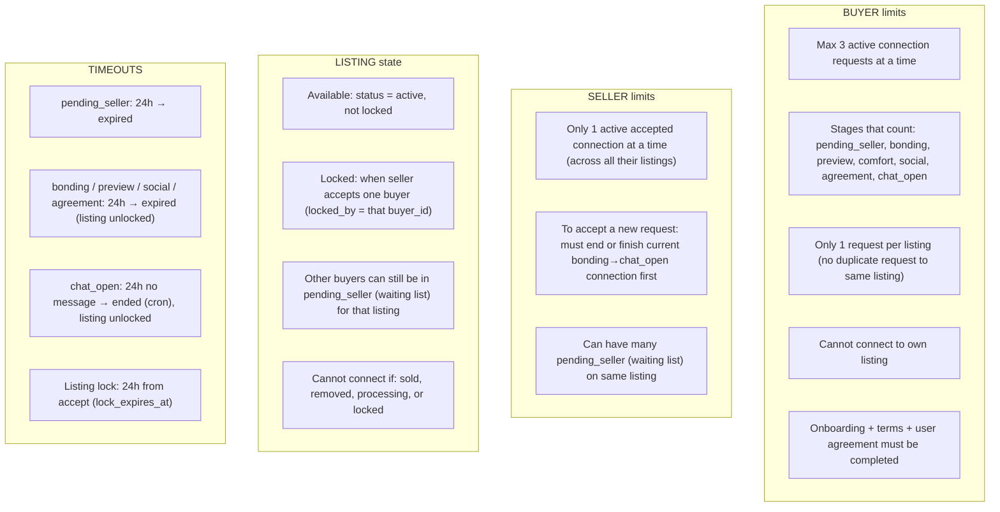

# Connections flow & limitations

This document describes the connection lifecycle and the main business rules (limits, locks, timeouts).

---

## 1. Stage flow (high level)

---

## 2. Detailed stage flow (with actors)

---

## 3. Limitations (rules)

---

## 4. Summary table

| Rule | Detail |
|------|--------|
| **Buyer: max active requests** | 3 total (any mix of pending_seller, bonding, preview, comfort, social, agreement, chat_open). |
| **Buyer: per listing** | At most one connection per listing in those stages (unique on `(listing_id, buyer_id)` where stage is active). |
| **Seller: one active deal** | Seller can have only one connection in bonding→chat_open at a time. Other requests stay in waiting list (pending_seller). |
| **Listing lock** | When seller accepts, listing becomes `locked` and `locked_by = buyer`. Only that buyer’s connection progresses; others stay pending_seller. |
| **Stage timeouts** | pending_seller, bonding, preview, social, agreement: 24h each. After timeout, connection goes to expired (or ended) and listing is unlocked if it was locked. |
| **Chat inactivity** | If chat_open and no message for 24h, cron can set connection to ended and unlock listing. |
| **End / release** | Buyer or seller can end connection (release); listing unlocks if it was locked by that connection. |

---

## 5. Notifications (relevant to flow)

- **Seller accepts one buyer** → Accepted buyer and seller get “Connection accepted”. All other buyers for that listing (waiting list) get “You’re on the waiting list”.
- **Connection ended** → Only the party who did *not* end it gets a notification, with a reason (e.g. seller ended, buyer ended, listing sold, listing removed by seller/admin).
